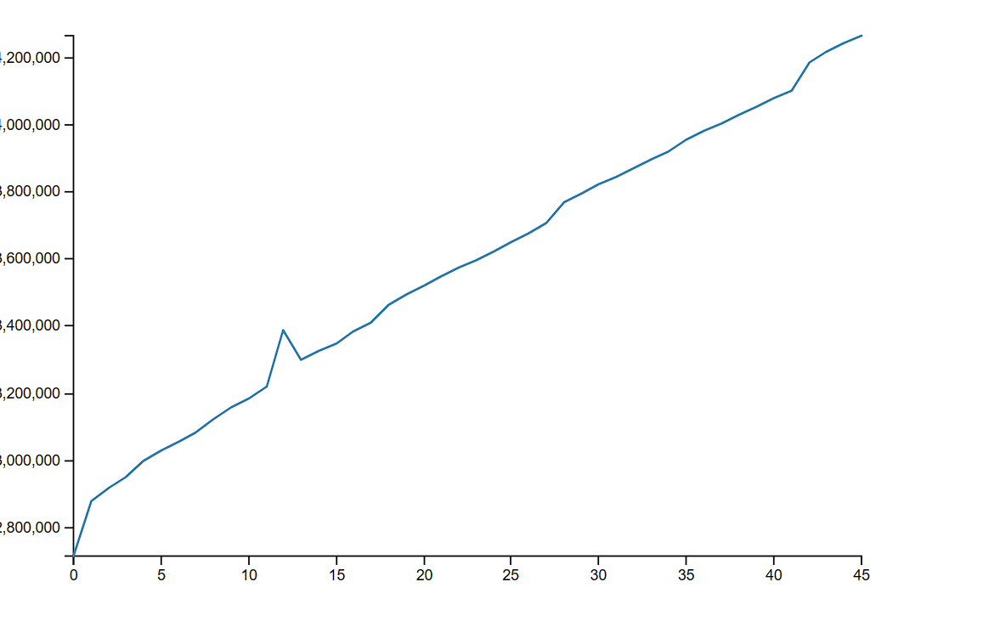
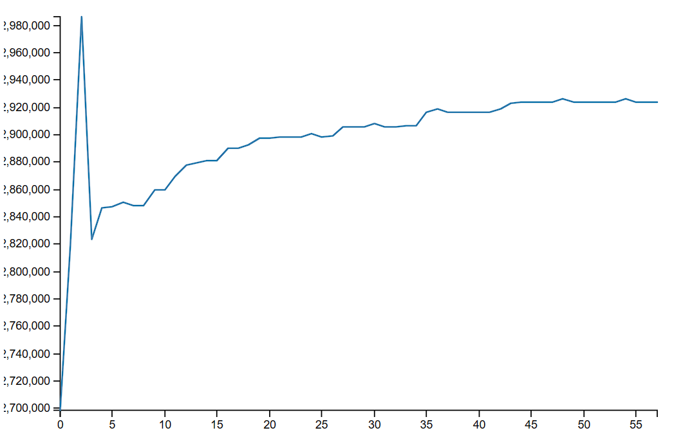

# Node Mem Leak

This project is to demonstrate a leak and how to fix it with proper teardown.
It is based on https://techtldr.com/simple-guide-to-finding-a-javascript-memory-leak-in-node-js/

Plotting requires Python3 and matplotlib

`pip install -r requirements.txt`

## Leak and observe

First run `npm run leak` w/out options, and finish the steps to see the leak chart.

Then run it again with the flags to see the fix.

1. `npm i`
2. `npm run leak`
   - `npm run leak -- --fixed` (fix the leak)
   - `npm run leak -- --clean` (clean heapdump files)
   - `npm run leak -- --fixed --clean` (fix the leak, clean heapdump files)
3. `ctrl+c`
4. `npm run plot`
5. `npm run server`
6. Navigate browser to http://localhost:3000
7. Observe the leak graph of memory over time
   - If no --fixed flag you'll see up and to the right
   - if --fixed flag you'll see it flatten out and maintain

## Leaking Example

## Fixed Leak Example

